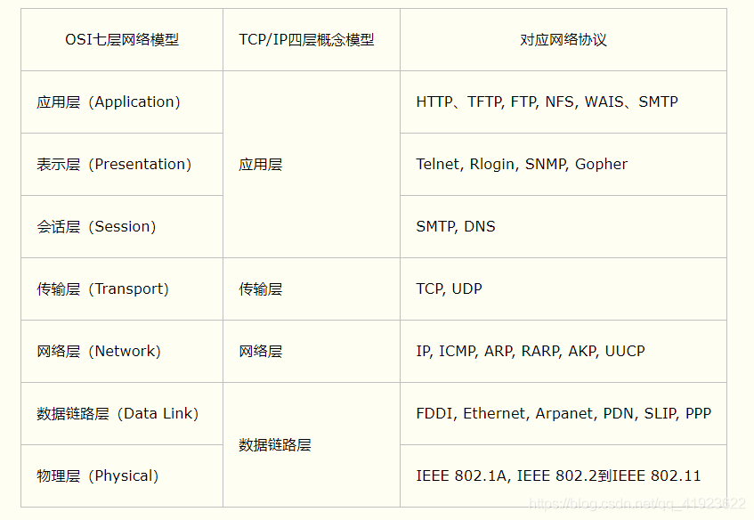

</img>

第一层：物理层

      利用传输介质为数据链路层提供物理连接，实现比特流的透明传输。

第二层：数据链路层

      通过差错控制、流量控制方法，使有差错的物理线路变为无差错的数据链路，即提供可靠的通过物理介质传输数据的方法。

第三层：网络层

      在数据链路层提供的两个相邻端点之间的数据帧的传送功能上，进一步管理网络中的数据通信。控制数据链路层与传输层之间的信息转发，建立、维持和终止网络的连接，
      将数据设法从源端经过若干个中间节点传送到目的端（点到点），从而向传输层提供最基本的端到端的数据传输服务。

第四层：传输层

    向用户提供可靠的端到端的差错和流量控制，保证报文的正确传输。
    同时向高层屏蔽下层数据通信的细节，即向用户透明地传送报文。

第五层：会话层

      组织和协调两个会话进程之间的通信，并对数据交换进行管理。
      会话层的具体功能如下：

      会话管理：允许用户在两个实体设备之间建立、维持和终止会话，并支持它们之间的数据交换。
      会话流量控制：提供会话流量控制和交叉会话功能。
      寻址：使用远程地址建立会话连接。
      出错控制：从逻辑上讲会话层主要负责数据交换的建立、保持和终止，但实际的工作却是接收来自传输层的数据，并负责纠正错误。

第六层：表示层

      处理用户信息的表示问题，如编码、数据格式转换和加密解密等。表示层的具体功能如下：

      数据格式处理：协商和建立数据交换的格式，解决各应用程序之间在数据格式表示上的差异。
      数据的编码：处理字符集和数字的转换。
      压缩和解压缩：为了减少数据的传输量，这一层还负责数据的压缩与恢复。
      数据的加密和解密：可以提高网络的安全性。

第七层：应用层

       直接向用户提供服务，完成用户希望在网络上完成的各种工作。
       应用层的具体功能如下：

用户接口：应用层是用户与网络，以及应用程序与网络间的直接接口，使得用户能够与网络进行交互式联系。
实现各种服务：该层具有的各种应用程序可以完成和实现用户请求的各种服务。
